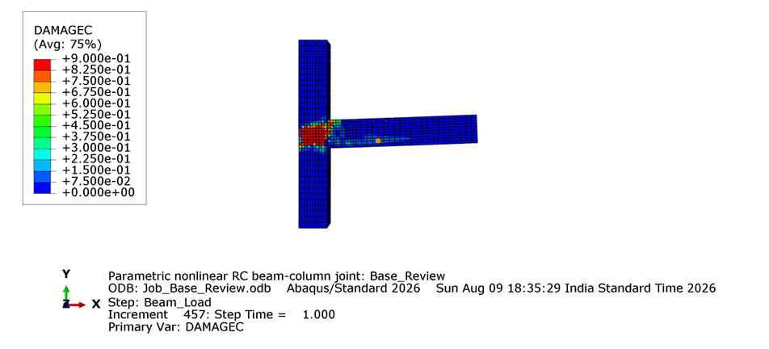
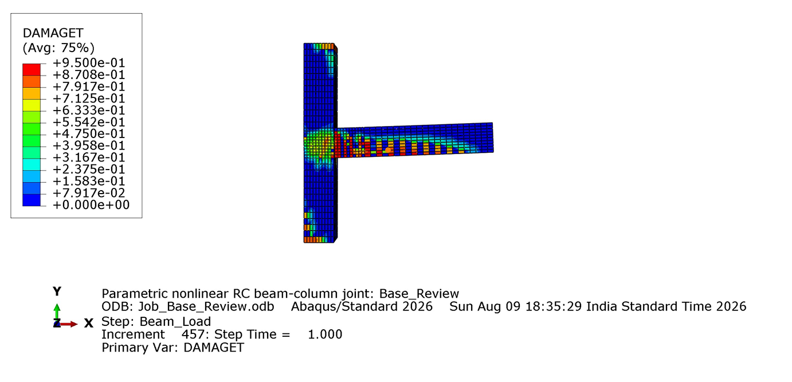

# Parametric Nonlinear RC Beam-Column Joint Modelling in Abaqus

This project presents an automated finite-element workflow for nonlinear analysis of a reinforced-concrete beam-column joint using the Abaqus Python API. The workflow generates the model, assigns nonlinear material behaviour, applies boundary conditions and loading, executes the analysis, and extracts engineering results for comparison.

## Why This Project Matters

Reinforced-concrete beam-column joints are critical regions in moment-resisting frames because they transfer high shear, bond, and confinement demands between beams and columns. Manual nonlinear modelling in Abaqus is time-consuming and difficult to reproduce, so this project focuses on automation, parametric comparison, and engineering interpretation.

## What The Script Builds

The Abaqus script automatically creates:

- Concrete beam and column solid geometry
- Longitudinal beam reinforcement
- Longitudinal column reinforcement
- Beam stirrups and column ties
- Embedded reinforcement constraints
- Concrete damaged plasticity material model
- Steel elastic-plastic reinforcement model
- Column-base fixity
- Axial load on the column
- Monotonic or cyclic beam-tip displacement loading
- Datum-plane partitions around the joint
- Locally refined structured `C3D8R` concrete mesh and `T3D2` reinforcement mesh
- Job creation, submission, and completion monitoring
- Automated extraction of load-displacement and damage results

## Parametric Study

By default, the script builds and runs **one baseline model** so its modelling assumptions and convergence can be validated. The full parametric set can be enabled later from `RUN_SETTINGS`.

The parametric study varies:

- Stirrup spacing: 75 mm, 100 mm, 150 mm
- Concrete compressive strength: 35 MPa and 45 MPa

The same framework can also be extended to vary:

- Reinforcement ratio
- Beam-column size ratio
- Column axial load ratio
- Joint confinement
- Loading protocol

## Outputs Compared

After jobs are run and result extraction is enabled, the script exports:

- Beam-tip load-displacement curve
- Maximum load
- Maximum displacement
- Initial stiffness
- Secant stiffness
- Tensile concrete damage
- Compressive concrete damage
- Reinforcement stress
- First tensile-damage load, displacement, element, and approximate coordinates
- Interpreted failure mode

Results are written to:

```text
Project_2/rc_joint_results/
```

with one load-displacement CSV per case and a combined:

```text
parametric_summary.csv
```

The saved `rc_joint_parametric_models.cae` database and `Job_Base_Review.inp` input file are included with the project. The complete ODB can be distributed separately as a GitHub release asset because of its size.

## How To Run

The default workflow automatically builds, submits, and extracts results for one baseline model. The full parametric batch remains disabled until the baseline analysis has been validated.

Open a terminal in this folder and run the script through Abaqus/CAE:

```bash
abaqus cae script=abaqus_rc_joint_parametric.py
```

This creates the concrete joint, reinforcement, embedded constraints, material definitions, mesh, steps, loads, boundary conditions, and job definition. It then submits the baseline job, waits for completion, and extracts the available results.

The default review model is an exterior beam-column joint: the beam is attached at the column face, centered vertically at the joint, and centered through the column width.

The script also saves an Abaqus database:

```text
rc_joint_parametric_models.cae
```

You can use the Abaqus/CAE Job Monitor to follow the nonlinear analysis while it runs.

For unattended baseline execution without opening the full GUI, use:

```bash
abaqus cae noGUI=abaqus_rc_joint_parametric.py
```

After the baseline model is validated, enable the complete parametric study by changing `build_all_parametric_cases` to `True` near the top of the script:

```python
RUN_SETTINGS = {
    "clear_previous_generated_models": True,
    "build_all_parametric_cases": True,
    "submit_jobs": True,
    "extract_results": True,
    "save_cae": True,
    "cae_file": "rc_joint_parametric_models.cae",
}
```

The script is intended for the Abaqus/CAE Python environment because it imports Abaqus-specific modules such as `abaqus`, `abaqusConstants`, `mesh`, and `odbAccess`.

## Loads And Damage Review

The analysis uses two sequential nonlinear static steps:

- `Axial_Load` applies the column axial force at `RP_COLUMN_TOP` while the column base is fixed.
- `Beam_Load` retains the axial force and applies the prescribed vertical displacement at `RP_BEAM_TIP`.

To inspect analysis results, open `Job_Base_Review.odb` in the Visualization module. Do not select a boundary-condition variable from the `.cae` model database for a contour plot.

For concrete tensile damage, choose field output `DAMAGET` at the integration points. A value of `0` is undamaged and a value approaching `1` indicates severe tensile stiffness degradation. Animate the frames to see where damage starts and how it spreads. Use `DAMAGEC` for compressive damage and `S, Mises` on the reinforcement display group for steel stress.

The combined `parametric_summary.csv` reports the first frame where `DAMAGET` reaches the configured `damage_onset_threshold`, together with beam-tip reaction, displacement, element label, and approximate element-centroid coordinates.

## Baseline Damage Results

### Compressive Damage



Compressive damage concentrates in the joint panel and at the beam-column interface. The maximum `DAMAGEC` value reaches `0.90`, indicating localized concrete crushing risk at the final `3.5%` drift level. The model nevertheless retains approximately `99.5%` of its peak global resistance at the final frame.

### Tensile Damage



Tensile damage spreads from the joint panel into the beam. The maximum `DAMAGET` value reaches `0.95`, indicating severe localized cracking and substantial stiffness degradation. Damage near the column ends should be interpreted cautiously because local concentrations can be influenced by the coupling and support boundary conditions.

## Engineering Interpretation

The baseline model reached the prescribed `84 mm` beam-tip displacement (`3.5%` drift) and produced the following response:

- First tensile damage at approximately `8.56 kN` and `0.57 mm` beam-tip displacement
- Peak lateral resistance of `80.74 kN` at approximately `78.87 mm`
- Final resistance of `80.34 kN`, retaining approximately `99.5%` of peak load
- Maximum reinforcement stress of approximately `537 MPa`, exceeding the `500 MPa` yield strength
- Maximum tensile and compressive damage values of `0.95` and `0.90`, respectively

These results indicate reinforcement yielding, substantial stiffness degradation, and localized concrete damage while the joint retains most of its peak global resistance at the target drift. The parametric cases are intended to test the following trends:

- Reducing stirrup spacing should improve joint confinement, delay damage concentration, and increase post-cracking stiffness retention.
- Increasing concrete strength should increase compressive capacity and initial stiffness, but may not fully prevent joint damage if confinement is inadequate.
- Higher reinforcement stress near the beam-column interface indicates flexural yielding or bond-critical behaviour.
- Concentrated tensile damage in the joint panel suggests joint shear cracking, while high compressive damage near the compression zone suggests crushing risk.
